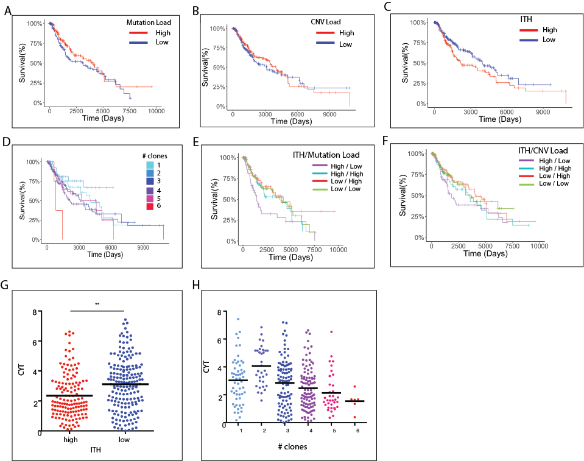
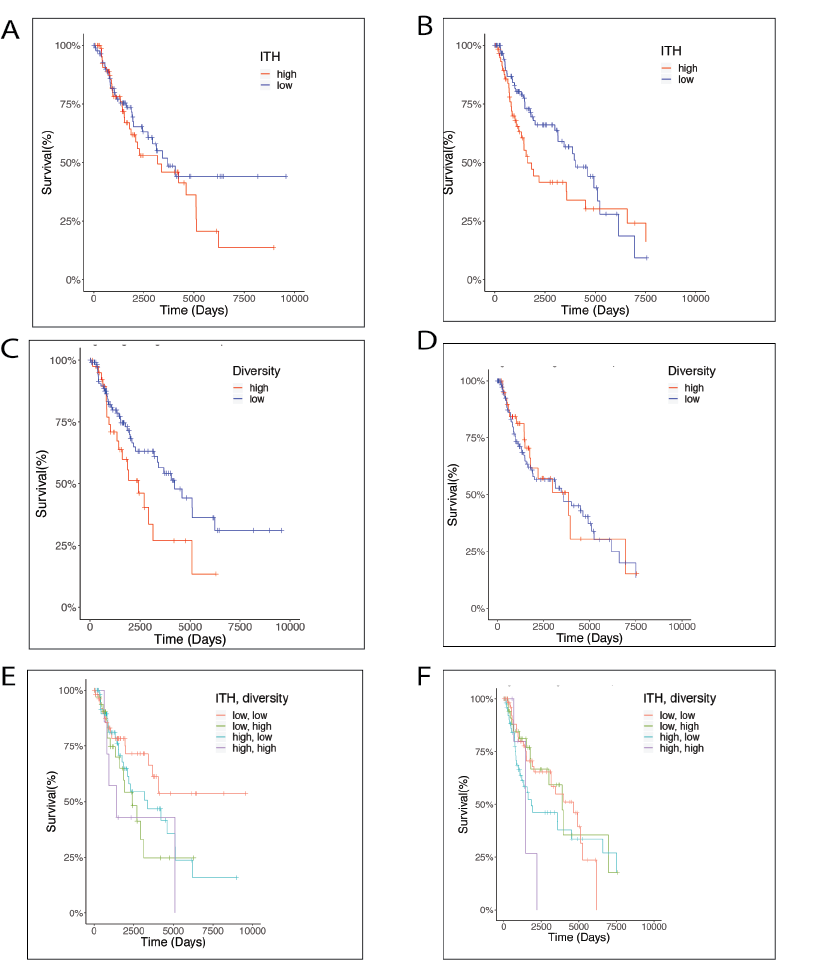

# UVB-induced tumor heterogeneity directs immune response in melanoma  
Little is known regarding the relationship between intratumor heterogeneity (ITH) and immune response in melanoma. Here we study this question in a novel, controlled experimental UVB mouse melanoma model that enables one to study the effects of intra-tumor heterogeneity on tumor aggressiveness and immune response independently of tumor mutational burden (TMB). The induction of UVB-derived mutations in parental melanoma cell-lines gives rise to high TMB tumors that are highly aggressive accompanied by decreased anti-tumor activity of tumor infiltrating lymphocytes (TILs). However, strikingly, UVB single-cell derived melanoma clones with similar high TMB levels but reduced ITH are swiftly rejected. Their rejection is accompanied by increased TIL reactivity, increased CD8+ T cell core infiltration and a less suppressive microenvironment. Using phylogenetic tree analyses and mixing experiments of 20 single cell UVB clones that lie along the phylogenetic tree we show that tumor rejection is inversely associated with the number of injected clones and their genetic diversity. Notably, similar observations are recapitulated and reinforced in the analysis of melanoma patient data, both in terms of overall melanoma patient survival and in response to immune check point therapy.  Taken together, our results highlight the importance of tumor ITH in melanoma and put forward the need to carefully quantify it, when evaluating patient survival and response to checkpoint blockade. This repository provides the code for recapitulating experimental results in TCGA patient data. For more information, contact sushantpatkar1994@gmail.com

# Overall survival as a function of number of clones, mutation load and copy number alteration load in TCGA-SKCM cohort

A) Kaplan-Meier survival curves (time is measured in days on the X axis) of patients with high vs. low mutational load. Log rank statistic:1.96, p=0.16. B) Kaplan-Meier survival curves of patients with high vs. low CNV load Log rank statistic:0.31, p=577. C) Kaplan-Meier survival curves of patients with high vs. low ITH. Log rank statistic:3.97, p=0.046 D) Kaplan-Meier survival curve for patients segregated by number of clones. E) Kaplan-Meier survival curves of patients segregated based on the combination of mutational load and ITH. Log rank statistic:9.20, p=0.0267. F) Kaplan-Meier survival curves of patients segregated based on the combination of CNV load and ITH. Log rank statistic:4.57, p=0.206. G) CYT score of patients with high vs. low ITH. p-value = 7.6e-05, Wilcox’s rank sum test. H) CYT score of patients segregated by number of clones.

# Overall survival as a function of number of clones and clone lineage diveristy in TCGA-SKCM patients with high and low UV exposure 

A) Kaplan-Meier survival curves (time is measured in days on the X axis) of patients with high exposure to UV (COSMIC signature 7) and high ITH compared to patients with high exposure to UV and low ITH. Log-rank statistic = 1.19, p-value = 0.27. B) Kaplan-Meier survival curves (time is measured in days on the X axis) of patients with low exposure to UV (COSMIC signature 7) and high ITH compared to patients with low exposure to UV and low ITH. Log-rank statistic = 2.604, p-value = 0.11. C) Kaplan-Meier survival curves (time is measured in days on the X axis) of patients with high exposure to UV (COSMIC signature 7) and high diversity compared to patients with high exposure to UV (COSMIC signature 7) and low diversity. Log-rank statistic = 3.83, p-value = 0.05  D) Kaplan-Meier survival curves (time is measured in days on the X axis) of patients with low exposure to UV (COSMIC signature 7) and high diversity compared to patients with low exposure to UV (COSMIC signature 7) and low diversity. Log-rank statistic = 0.07, p-value = 0.79.   E) Kaplan-Meier survival curves (time is measured in days on the X axis) of patients with high exposure to UV (COSMIC signature 7) and belonging to either of the 4 categories: (high ITH, high diversity), (high ITH, low diversity), (low ITH, high diversity), (low ITH, low diversity) Log-rank statistic = 6.74, p-value = 0.08.  F) The same as E but among patients with low exposure to UV(COSMIC signature 7) Log-rank statistic = 4.48, p-value = 0.214. 

# Publication
Currently under review

